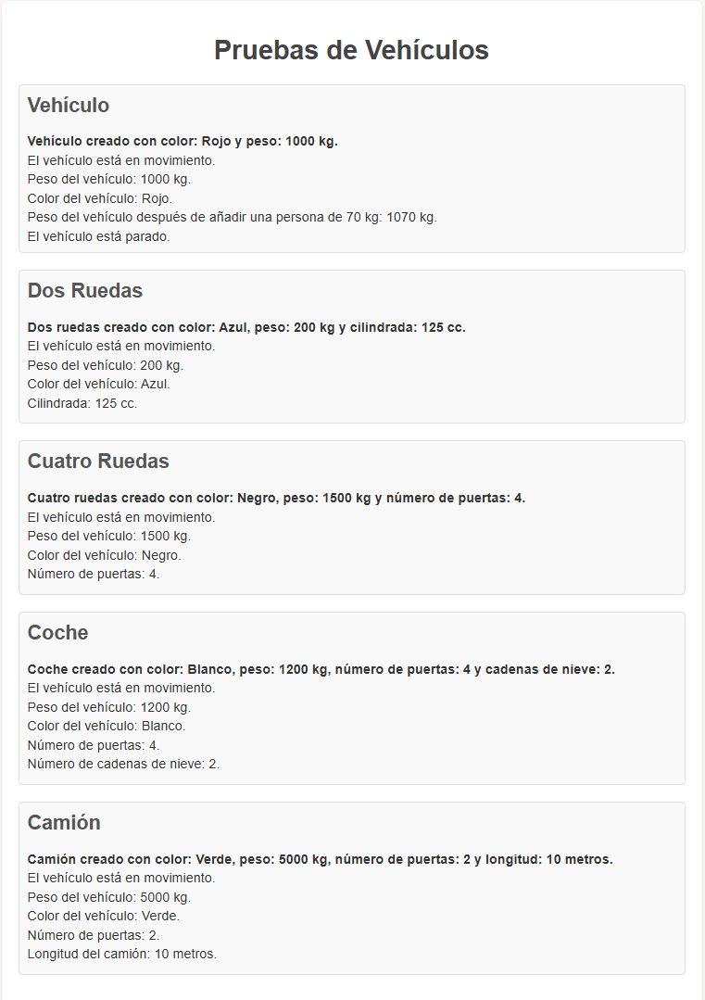
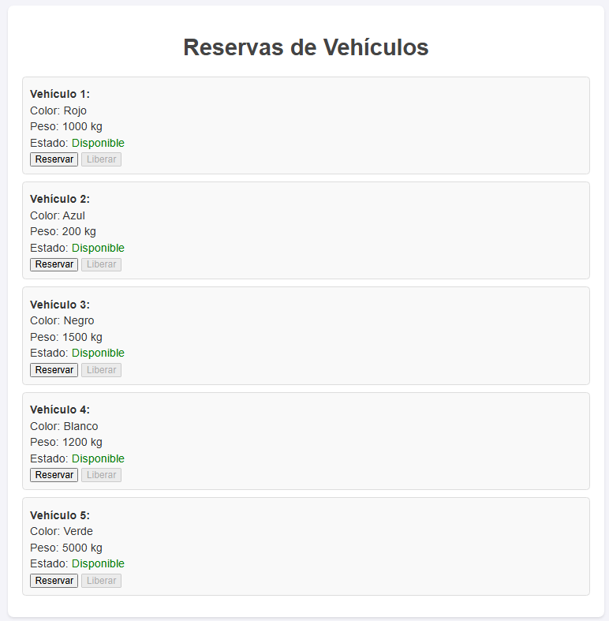
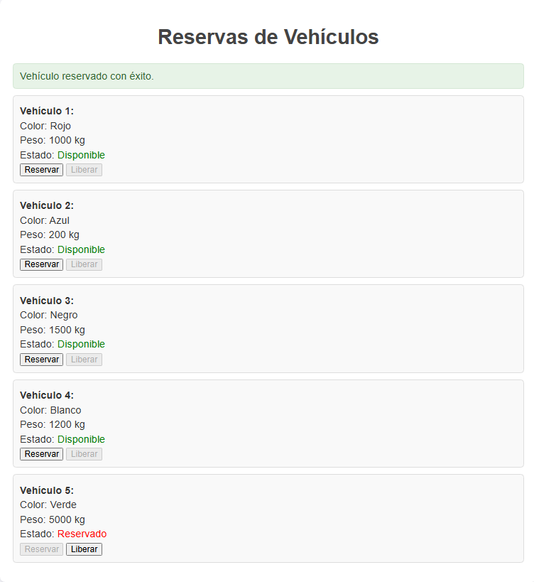

# Documentación del Sistema de Vehículos

## Archivos
1. `prueba.php` - Página de demostración que prueba las clases de vehículos.
2. `vehiculo.php` - Contiene la jerarquía de clases de vehículos.
3. `reservas.php` - Formulario que permite la reserva de vehiculos de manera interactiva.

## Clases Principales

### Clase Base: `Vehiculo`

**Propiedades:**
- `private $color` - Color del vehículo
- `private $peso` - Peso en kg

**Métodos:**
- `__construct($color, $peso)` - Constructor
- `circula()` - Muestra mensaje de movimiento
- `para()` - Muestra mensaje de detención
- `getPeso(): int` - Devuelve el peso
- `getColor(): string` - Devuelve el color
- `añadir_persona($peso_persona)` - Aumenta el peso con el peso de una persona

### Clase `Dos_ruedas` (hereda de `Vehiculo`)

**Propiedad adicional:**
- `private $cilindrada` - Cilindrada en cc

**Métodos:**
- `__construct($color, $peso, $cilindrada)` - Constructor
- `getCilindrada(): int` - Devuelve la cilindrada

### Clase `Cuatro_ruedas` (hereda de `Vehiculo`)

**Propiedad adicional:**
- `private $numPuertas` - Número de puertas

**Métodos:**
- `__construct($color, $peso, $numPuertas)` - Constructor
- `getnumPuertas(): int` - Devuelve el número de puertas

### Clase `Coche` (hereda de `Cuatro_ruedas`)

**Propiedades adicionales:**
- `private $numCadenasNieve` - Número de cadenas para nieve
- `const NUM_CADENAS_NIEVE_MAX = 4` - Máximo de cadenas
- `const NUM_CADENAS_NIEVE_MIN = 0` - Mínimo de cadenas

**Métodos:**
- `__construct($color, $peso, $numPuertas, $numCadenasNieve)` - Constructor
- `getnumCadenasNieve(): int` - Devuelve el número de cadenas
- `añadir_cadena($cantidad_cadenas)` - Añade cadenas (con límite máximo)
- `quitar_cadena($cantidad_cadenas)` - Quita cadenas (con límite mínimo)

### Clase `Camion` (hereda de `Cuatro_ruedas`)

**Propiedad adicional:**
- `private $longitud` - Longitud en metros

**Métodos:**
- `__construct($color, $peso, $numPuertas, $longitud)` - Constructor
- `getLongitud(): int` - Devuelve la longitud

## Diagrama de Clases

- `Vehiculo` es la clase base.
- ``Dos_ruedas`` y ``Cuatro_ruedas`` extienden ``Vehiculo``.
- ``Coche`` y ``Camion`` extienden ``Cuatro_ruedas``.


## Archivo "prueba.php"

La página `prueba.php` demuestra:
1. Creación de instancias de cada tipo de vehículo
2. Llamada a métodos comunes y específicos
3. Visualización de propiedades mediante getters

**Características de la interfaz:**
- Diseño responsive con CSS
- Secciones separadas para cada tipo de vehículo
- Visualización clara de los resultados de las operaciones

**Pantallazo de que imprime prueba.php**




## Descripción de "reservas.php"
Sistema de gestión de reservas para vehículos que utiliza la jerarquía de clases definida en `Vehiculo.php`. Permite reservar y liberar vehículos mediante una interfaz web.

**Características principales**
- Gestión de estado (reservado/disponible) de vehículos
- Interfaz intuitiva con botones condicionales
- Persistencia de reservas mediante sesiones PHP
- Visualización del estado en tiempo real

**Estructura del código**

**Variables y Configuración Inicial**
```php
$vehiculos = [ /* array de instancias de vehículos */ ];
session_start();
if (!isset($_SESSION['reservas'])) {
    $_SESSION['reservas'] = [];
}
```
**Funcionamiento y vista**

Al ejecutarse el archivo muestra la siguiente información:



Si se pulsa el botón de reservar la vista cambia, actualizando la información. Al reservar por ejemplo el vehículo 5 se ve así:


